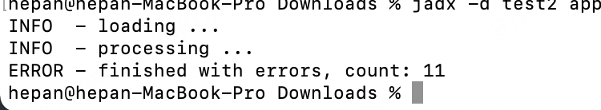
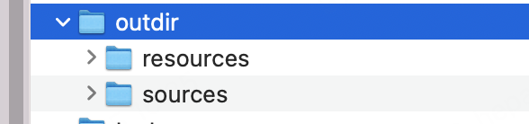

# jadx 使用: Dex to Java decompiler

[官网](https://github.com/skylot/jadx)

jadx 可以反编译 Dex 为 java 文件. 

日常编译 App 时, 第三方库的代码很难直观的查看, 通过反编译 Apk 为 java 文件, 可以提供一定帮助

## 安装(mac): `brew install jadx`

## 使用: (需要设置 JAVA_HOME)

- 直接编译 apk: `jadx -d <output_directory> <path_to_apk>`

eg: `jadx -d outdir app.apk`

编译完控制台提示:

具体文件: (可以通过 Android Studio 打开,搜索相关代码)

