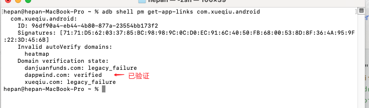

## 简介
[官网](https://developer.android.com/training/app-links)


App links 可以帮助用户更方便获取 App 内容.  其不同类型与关联示意图如


1. Deep links 处理 URIs, 支持任意类型 scheme
2. Web links 是限定 HTTP 和 HTTPS 作为 scheme 的 Deep links ( 系统版本 >= Android 12 点击 Web links 将直接打开浏览器)
3. Android App Links 与 Web links 的区别在于
  - intenter-filter 添加 autoVerify 
  - 依赖于系统服务, 需验证 App Links

```
    <intent-filter android:autoVerify="true">
        <action ...

        <data ...
    </intent-filter>
```

## Deep links

>备注: 测试设备包括 Mate30 Android12  , Pixel3 Androi12  ,OPPO A93 Android11

通过 Deep link 实现 App 跳转有两种情况, 主要区别在于是否经浏览器中转


点击 URI 唤起 App
  **从短信或者备忘录** 之类的应用中点击 URI 链接(App 已添加匹配规则), 按照官方文档是可以唤起选择弹框的, 但测试中没有复现此功能, 全部唤起了浏览器

## 通过浏览器唤起 App

目前测试的 Depp Link 全部走上图右侧流程, 点击 URI 唤起浏览器, 浏览器通过超链接唤起 App

### 总结

备注: 仅限已测试机型
1. 在短信, 备忘录等应用中点击 URI, 只有唤起浏览器一条路径
2. 通过 浏览器+超链接 唤起 App, 当 scheme 为 http(s) 时, 部分机型会直接唤起浏览器, 无法唤起 App.  当使用自定义 scheme 时, 可以跳转到 App. 


综上所述, 我们通过系统浏览器跳转时, 需要采用**自定义 scheme** 进行跳转

## Android App Links
> 依赖于系统能力, 无需浏览器中转从短信等应用跳转到 App

指定 App 可以处理某种 URL , 当 App 已安装时, 点击此类 URL 会立即打开应用而没有中间过程.

App 清单文件配置
// 1. 添加  android:autoVerify="true"
<intent-filter android:autoVerify="true">
    <category android:name="android.intent.category.DEFAULT" />
    <action android:name="android.intent.action.VIEW" />
    <category android:name="android.intent.category.BROWSABLE" />

   // 2. 配置匹配规则
    <data
        android:host="danjuanfunds.com"
        android:pathPattern="/j/.*"
        android:scheme="https" />
    <data
        android:host="xueqiu.com"
        android:pathPattern="/j/.*"
        android:scheme="https" />
</intent-filter>

修改完毕后运行 App,  然后可以通过 adb shell pm get-app-links com.xueqiu.android 命令查看验证结果. 因为此时还没有进行验证, 所以域名验证状态均为 legacy_failure

### 华为 Mate 30 结果


### OPPO 结果

无法使用此命令,报错: Unknown command: get-app-links

验证 app links

具体实现步骤可查看官网: https://developer.android.com/training/app-links/verify-android-applinks

- 添加新的匹配规则, 域名为 dappwind.com
// 1. 添加  android:autoVerify="true"
<intent-filter android:autoVerify="true">
    <category android:name="android.intent.category.DEFAULT" />
    <action android:name="android.intent.action.VIEW" />
    <category android:name="android.intent.category.BROWSABLE" />

   // 2. 配置匹配规则
    <data
        android:host="danjuanfunds.com"
        android:pathPattern="/j/.*"
        android:scheme="https" />
    ...
    // 3. 新的匹配规则(http, https 都要配置)
    <data
        android:host="dappwind.com"
        android:pathPattern="/j/.*"
        android:scheme="https" />
    <data
        android:host="dappwind.com"
        android:pathPattern="/j/.*"
        android:scheme="http" />
</intent-filter>
- 配置 https://dappwind.com/.well-known/assetlinks.json (发布到公网)

[公网链接配置的 json](./file/assetlinks.json)

- 利用 adb shell pm get-app-links com.xueqiu.android 查看 (Mate30 结果)



- App Link 打开应用 (Mate 30) 成功
- OPPO 系统不支持
- Pixel 失败

### AppLinks 总结:
App link 依赖于系统能力, 并不是所有机型都支持, 当 App link 无效时, 默认退化为 Deep Link , URL 点击表现与上面 DeepLink 流程图 一致. 


查看文档
- [About app links](https://developer.android.com/training/app-links)
- [verify-android-applinks](https://developer.android.com/training/app-links/verify-android-applinks)
- [Android 点击短信链接唤起APP的方案实践](https://juejin.cn/post/7287483692695289911?searchId=202405301931543EB306C79EC9F85E73AA)
- [Android 点击Url（短信链接）打开App](https://juejin.cn/post/6932402582569222157?searchId=202405301931543EB306C79EC9F85E73AA)
- [Android DEPPLINK、APPLink原理简析](https://juejin.cn/post/6854573214819958791?searchId=202405301817000DEA3A0627D5630EE54B)


