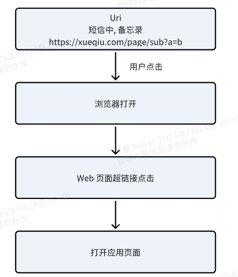
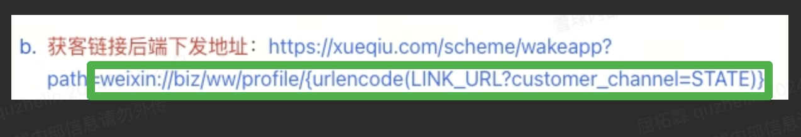
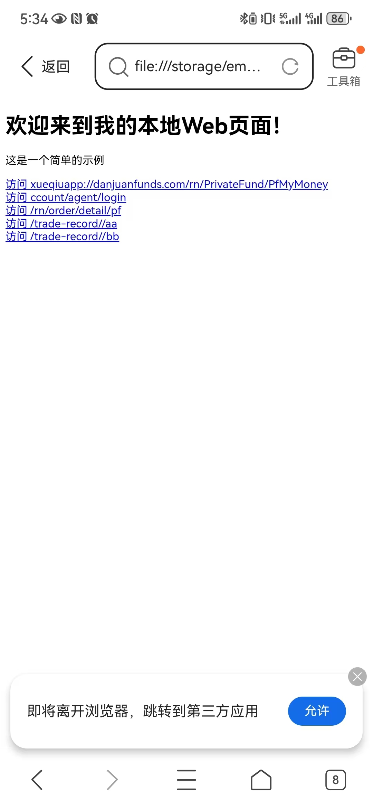

## 前言

通过 Applink 调研文档可以看出, 采用系统支持的 Applink 有较大局限性, 同时在 Android 12 之后, 超链接标签在某些机型上也不在支持 http 与 https 作为 scheme 跳转 App. 因此我们针对应用外跳转的需求, 需要先通过 URI 打开系统浏览器, 然后通过浏览器超链接标签+自定义 Scheme 跳转到应用



微信例子


## Android

1. 创建 Activity 
   
```kotlin
class SchemeCallbackActivity : AppCompatActivity() {
    override fun onCreate(savedInstanceState: Bundle?) {
        super.onCreate(savedInstanceState)
        setContentView(TextView(this))

        // 接收事件并做处理
        val uri: Uri? = intent.data
        if (uri !== null) {
          handleUri(uri)
        }
    }

    override fun onResume() {
        super.onResume()
        finish()
    }

     private fun handleUri(uri: Uri){

        try {
            val path = uri.path
            if (path.isNullOrEmpty()){
                return
            }
            val decodedURL = decodeMultipleTimes(uri.toString())

            if (path.startsWith("/router/to/")){
                // 动态路由
                val index = decodedURL.indexOf("/router/to/")
                val targetUrl = decodedURL.substring(index).replace("/router/to/","")
                if (targetUrl.isNotEmpty()){
                    println("hepan 动态路由跳转 $targetUrl")
                }
            }else{
                // 严格匹配
                val targetUrl = Uri.parse(decodedURL).buildUpon().scheme("https").build().toString()
                println("hepan 严格匹配 url = $targetUrl")
            }
        } catch (e: Exception) {

        }

    }

    /**
     * 尝试多次解码 URI
     * 1.系统浏览器可能会对 URI 进行编码
     * 2.web 开发者可能多次编码 URI
     */
    private fun  decodeMultipleTimes(encodedUrl: String, maxAttempts: Int = 6): String {
        var decodedUrl = encodedUrl
        for (i in 1..maxAttempts) {
            try {
                decodedUrl = URLDecoder.decode(decodedUrl, StandardCharsets.UTF_8.toString())
            } catch (e: IllegalArgumentException) {
                // 如果解码失败（通常意味着 URL 已经是最简形式），则退出循环
                break
            }
        }
        return decodedUrl
    }
}
```

1. 配置匹配规则
   
```xml
  <activity
        android:launchMode="singleInstance"
        android:name=".activity.SchemeCallbackActivity"
        android:exported="true">
        <intent-filter>
            <category android:name="android.intent.category.DEFAULT" />
            <action android:name="android.intent.action.VIEW" />
            <category android:name="android.intent.category.BROWSABLE" />


            <!--私募短信跳转 XUEQIU-27980-->
            <data
                android:host="danjuanfunds.com"
                android:path="/rn/PrivateFund/PfMyMoney"
                android:scheme="xueqiuapp" />

            <data
                android:host="danjuanfunds.com"
                android:path="/ccount/agent/login"
                android:scheme="xueqiuapp" />
            <data
                android:host="danjuanfunds.com"
                android:path="/rn/order/detail/pf"
                android:scheme="xueqiuapp" />

                <!--正则匹配-->
            <data
                android:scheme="xueqiuapp"
                android:host="danjuanfunds.com"
                android:pathPattern="/router/to/.*" />
            <!--私募短信跳转 XUEQIU-27980-->

            <!--正则匹配-->
            <data
                android:scheme="xueqiuapp"
                android:host="danjuanfunds.com"
                android:pathPattern="/router/to/.*" />
        </intent-filter>

    </activity>
```

总结
1. 启动模式设置为 singleInstance 可以解决冷启动打开后无法再次接收浏览器 Intent 事件问题
2. 可以通过 path 精确匹配, 也可以通过 pathPattern 模糊匹配

## H5

```html

<!DOCTYPE html>  
<html>  
<head>  
    <title>111</title>  
</head>  
<body>  
    <h1>欢迎来到我的本地Web页面！</h1>  
    <p>这是一个简单的示例</p>  

    <a href="xueqiuapp://danjuanfunds.com/rn/PrivateFund/PfMyMoney" target="_blank">访问   xueqiuapp://danjuanfunds.com/rn/PrivateFund/PfMyMoney</a>
    <br>
    <a href="xueqiuapp://danjuanfunds.com/ccount/agent/login" target="_blank">访问   ccount/agent/login</a>
    <br>
    <a href="xueqiuapp://danjuanfunds.com/rn/order/detail/pf" target="_blank">访问   /rn/order/detail/pf</a>
    <br>


    <a href="xueqiuapp://danjuanfunds.com/router/to/aa?a=badafd" target="_blank">访问   /router/to/aa</a>
    <br>
    <a href="xueqiuapp://danjuanfunds.com/router/to/bb?key=哈哈哒" target="_blank">访问   /router/to/bb</a>
</body>  
</html>
```

总结
1. 利用系统浏览器打开 index.html, 点击标签可以触发打开 App 操作 (Mate30)
2. 标签点击后交互与系统有关, 可能略有差别




## 通过 Intent 打开
> 实现 Web 超链接一样的效果, 可以通过 Intent 完成, 以便三方应用跳转到自己的 App

```
  val uri =
        Uri.parse("xueqiuapp://danjuanfunds.com/router/to/https://xueqiu.com/rn/PrivateFund/PfMyMoney?a=badafd")
    val intent = Intent()
    intent.data = uri
    startActivity(intent)
```