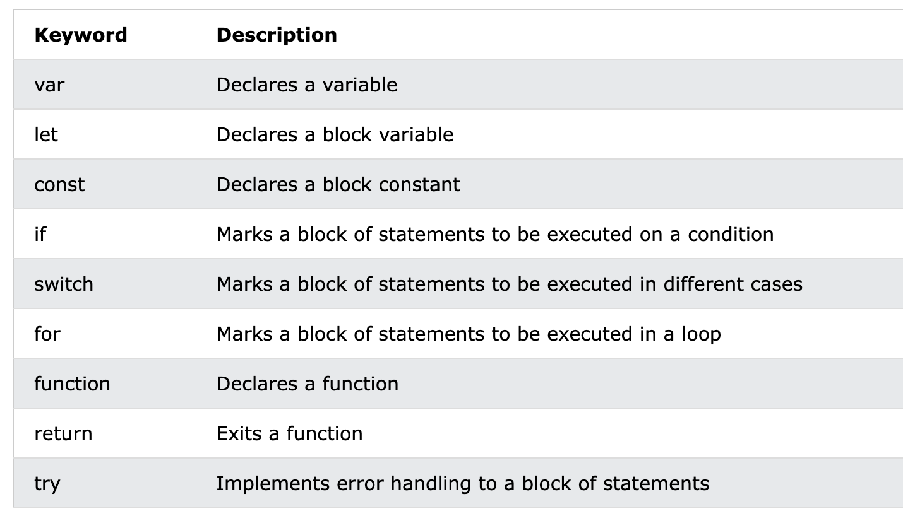

# JavaScript Output

[Demo: Output](demo/js_output.html)

## JavaScript Display Possibilities

jS 可以用下面四个方式 `展示` 数据

-Writing into an HTML element, using `innerHTML`.

-Writing into the HTML output using `document.write()`.

-Writing into an alert box, using `window.alert()`.

-Writing into the browser console, using `console.log()`.


## Using innerHTML

To access an HTML element, JavaScript can use the `document.getElementById(id)` method.

The id attribute defines the HTML element. The innerHTML property defines the HTML content:


## Using document.write()

**注意**: 
- Using document.write() after an HTML document is loaded, will delete all existing HTML:

- The document.write() method should **only be used for testing**.

```
<script>
document.write(5 + 6);
</script>
```

## Using window.alert()

```
<script>
window.alert(5 + 6);
</script>
```

**重点**

- You can skip the `window` keyword.

- In JavaScript, `the window object is the global scope object`. This means that variables, properties, and methods by default belong to the window object. This also means that specifying the window keyword is optional:

```
<script>
alert(5 + 6);
</script>
```

## Using console.log()

For debugging purposes, you can call the console.log() method in the browser to display data.

```
<script>
console.log(5 + 6);
</script>
```

## JavaScript Print

JavaScript does not have any print object or print methods.

You cannot access output devices from JavaScript.

The only exception is that you can call the window.print() method in the browser to print the content of the current window.


---

# JavaScript Statements

## JavaScript Programs

- A computer program is a list of "instructions" to be "executed" by a computer.

- In a programming language, these programming instructions are called statements.

- A JavaScript program is a list of programming statements.

**In HTML, JavaScript programs are executed by the web browser.**

## JavaScript Statements

JavaScript statements are composed of:

Values, Operators, Expressions, Keywords, and Comments.

## Semicolons (分号)

Semicolons separate JavaScript statements.

Add a semicolon at the end of each executable statement:

```
let a, b, c;  // Declare 3 variables
a = 5;        // Assign the value 5 to a
b = 6;        // Assign the value 6 to b
c = a + b;    // Assign the sum of a and b to c
```

When separated by semicolons, multiple statements on one line are allowed:

`a = 5; b = 6; c = a + b;`

> On the web, you might see examples without semicolons.
> Ending statements with semicolon is not required, but highly recommended.

## JavaScript White Space (空格)

JavaScript ignores multiple spaces. You can add white space to your script to make it more readable.

The following lines are equivalent:

A good practice is to put spaces around operators ( = + - * / ):

`let x = y + z;` 

## JavaScript Line Length and Line Breaks

For best readability, programmers often like to avoid code lines longer than 80 characters.

If a JavaScript statement does not fit on one line, the best place to break it is after an operator:

## JavaScript Code Blocks

JavaScript statements can be grouped together in code blocks, inside curly brackets {...}.

```
function myFunction() {
  document.getElementById("demo1").innerHTML = "Hello Dolly!";
  document.getElementById("demo2").innerHTML = "How are you?";
}
```

## JavaScript Keywords

JavaScript statements often start with a keyword to identify the JavaScript action to be performed.



---

