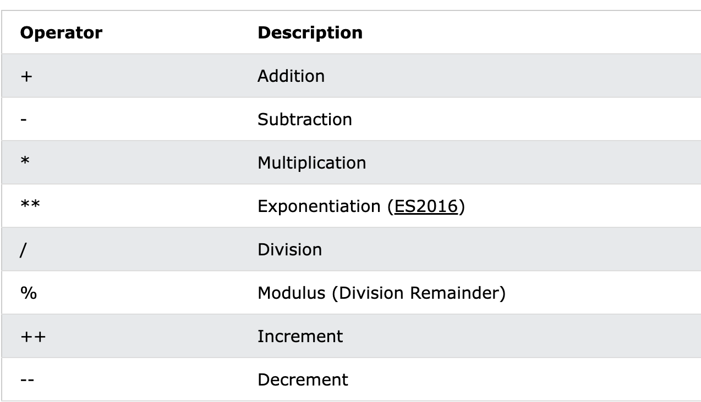
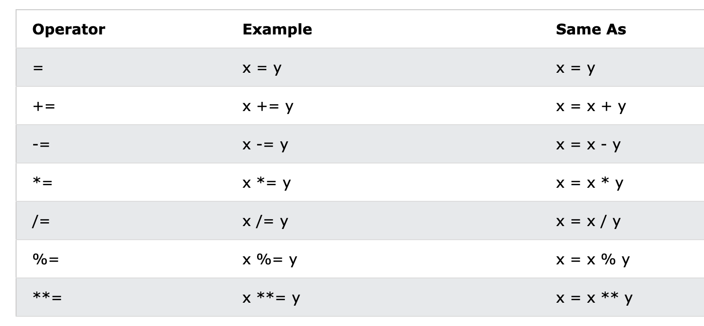
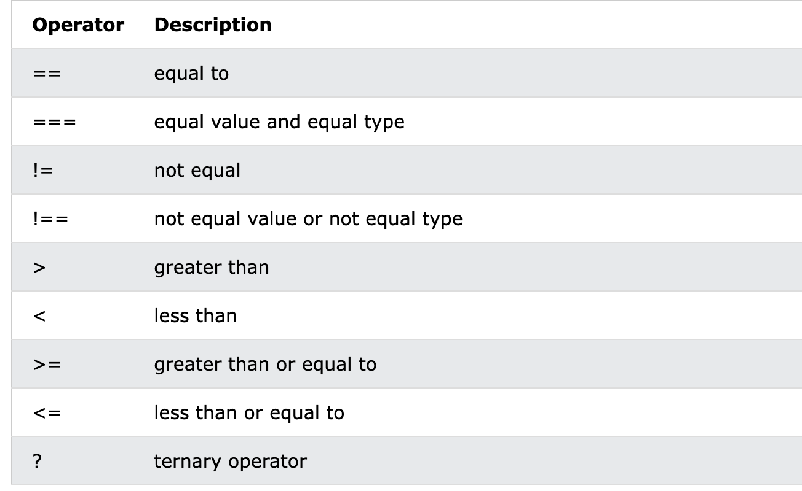
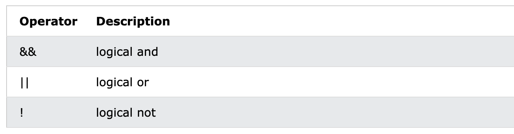
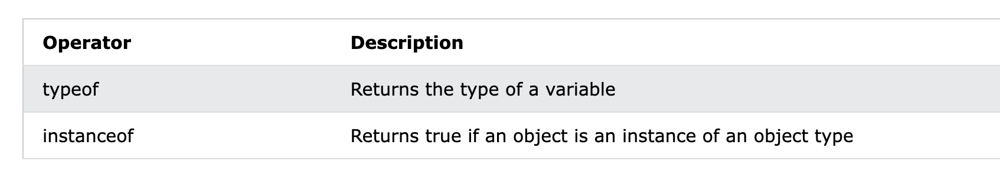
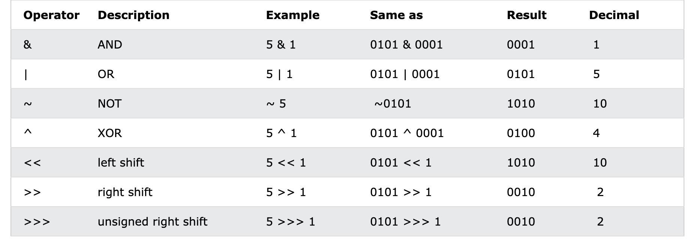

# JavaScript Operators

赋值运算符

The Assignment Operator (=) assigns a value to a variable:

`let x = 10;`

add 运算符

The Addition Operator (+) adds numbers:

JavaScript Multiplication *

## 算数运算符(JavaScript Arithmetic Operators)




## 赋值运算(JavaScript Assignment Operators)



## 比较运算(JavaScript Comparison Operators)



## 逻辑运算符(JavaScript Logical Operators)



## Type 运算 (JavaScript Type Operators)



## 位运算(JavaScript Bitwise Operators)



> jS 是 32 位有符号数字, 图片中只是用 4 bit 来模拟变化

Bit operators work on 32 bits numbers.

Any numeric operand in the operation is converted into a 32 bit number. The result is converted back to a JavaScript number.

---

# JavaScript Data Types

JavaScript has 8 Datatypes
1. String
2. Number
3. Bigint
4. Boolean
5. Undefined
6. Null
7. Symbol
8. Object

The object data type can contain:
1. An object
2. An array
3. A date

```
// Numbers:
let length = 16;
let weight = 7.5;

// Strings:
let color = "Yellow";
let lastName = "Johnson";

// Booleans
let x = true;
let y = false;

// Object:
const person = {firstName:"John", lastName:"Doe"};

// Array object:
const cars = ["Saab", "Volvo", "BMW"];

// Date object:
const date = new Date("2022-03-25");
```

## 类型链接

`let x = 16 + "volvo"` 
> Result 16volvo

总结: When adding a number and a string, JavaScript will treat the number as a string.

`let x = 16 + 4 + "Volvo";`
> Result 20Volvo

`let x = "Volvo" + 16 + 4;`
> Result Volvo164

总结: JS 从左到右执行,不同的顺序产生不同的结果.

## JS 类型是动态的

```
let x;       // Now x is undefined
x = 5;       // Now x is a Number
x = "John";  // Now x is a String
```

## 字符串
> 字符串(文本)是乙烯类字符集合, 用单引号/双引号包裹

可以在字符串中使用引号,只要其和包裹引号不同

```
// Single quote inside double quotes:
let answer1 = "It's alright";

// Single quotes inside double quotes:
let answer2 = "He is called 'Johnny'";

// Double quotes inside single quotes:
let answer3 = 'He is called "Johnny"';
```

## 数字

`let x = 32`

科学计数: 
```
let y = 123e5;    // 12300000
let z = 123e-5;   // 0.00123
```

JS 的 number 只有一种类型: `double (64-bit floating point).`

## JavaScript BigInt

JavaScript BigInt is a new datatype (ES2020) that can be used to store integer values that are too big to be represented by a normal JavaScript Number.

`let x = BigInt("123456789012345678901234567890");`

更详细的内容在后续章节

## 数组  Arrays

`const cars = ["Saab", "Volvo", "BMW"];`

## 对象 Objects

JavaScript objects are written with curly braces `{}`.

Object properties are written as `name:value` pairs, separated by commas.

`const person = {firstName:"John", lastName:"Doe", age:50, eyeColor:"blue"};`

## 类型操作符 : The typeof Operator

```
typeof ""             // Returns "string"
typeof "John"         // Returns "string"
typeof "John Doe"     // Returns "string"
```

```
typeof 0              // Returns "number"
typeof 314            // Returns "number"
typeof 3.14           // Returns "number"
typeof (3)            // Returns "number"
typeof (3 + 4)        // Returns "number"
```

## Undefined
`let car;    // Value is undefined, type is undefined`