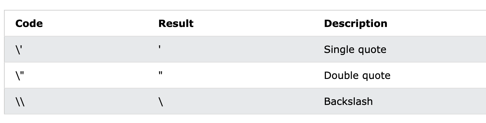
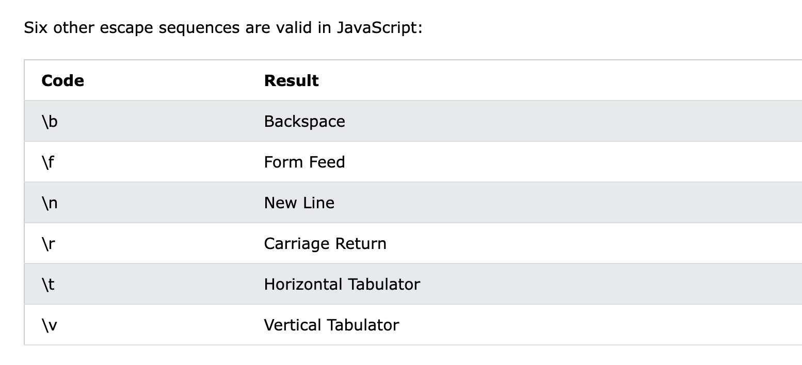

# JavaScript Strings


JavaScript strings are for storing and manipulating text.

A JavaScript string is zero or more characters written inside quotes.

```
let carName1 = "Volvo XC60";  // Double quotes
let carName2 = 'Volvo XC60';  // Single quotes
```

## 长度

```
let text = "ABCDEFGHIJKLMNOPQRSTUVWXYZ";
let length = text.length;
```

## 转义字符

[Demo: 字符串相关](demo/js_string_learn_01.html)

The backslash (\) escape character turns special characters into string characters:

**总结**: 利用反斜杠 \ 来转义字符

Exapmle


**重点** 下面的六种转义在 JS 中是`失效`的



## 作为 Object 的 String

> string 一般作为基础类型使用, 有时也会作为 Object 使用

`let y = new String("John");`

**重点**
Do not create Strings objects. 尽量避免使用 String

The new keyword complicates the code and slows down execution speed.

String objects can produce unexpected results:

---

# JavaScript String Methods

常用的 String 方法
```
String length
String slice()
String substring()
String substr()
String replace()
String replaceAll()
String toUpperCase()
String toLowerCase()
String concat()
String trim()
String trimStart()
String trimEnd()
String padStart()
String padEnd()
String charAt()
String charCodeAt()
String split()
```

## 长度

```
let text = "ABCDEFGHIJKLMNOPQRSTUVWXYZ";
let length = text.length;
```

## 子串

获取子串的三个方法
```
slice(start, end)
substring(start, end)
substr(start, length)
````

### Slice

- slice() 截取并返回新的字符串
- slice 接收两个参数(start,end), 0 开头, 包头部包尾
- end 参数缺省,将截取 start 之后的所有字符串 `let part = text.slice(7);`
- 入参为负数,具体位置从字符串末尾开始计算 `let part = text.slice(-12, -6);`
  
```
let s = '0123456789'
s.slice(0,3)        // 012
s.slice(5)          // 56789
s.slice(-4,-1)      // 678
slice(-4)           // 6789
```

### substring

substring 和 slice 很像, 两者区别是

- 当入参小于 0 时, substing 作为 0 处理

`s.substring(0,3) == s.substring(-3,3)`

### substr

substr 和 slice 很像, 两者区别是
- substr 的第二个参数代表截取长度而不是位置

```
let s = '0123456789'
s.substr(1,1)   // 1
s.substr(7)     // 789
s.substr(-4,2)  // 67
```

## 字符串替换

[Demo: replace](demo/js_string_replace.html)

`replace()` 方法可以替换特定字符串到新的字符串

- replace() 不会改变原始字符串
- replace() 返回新的字符串
- replace() 只替换第一个匹配的字符串,如果想替换全部匹配,使用  /g
- replace() 区分大小写, 使用 /i 不区分大小写

```
let text = "Please visit Microsoft and Microsoft!";
// 默认只替换第一个: Please visit W3Schools and Microsoft!
let newText = text.replace("Microsoft", "W3Schools");
```

```
let text = "Please visit Microsoft!";
// 区分大小写: Please visit Microsoft!
let newText = text.replace("MICROSOFT", "W3Schools");
```

```
let text = "Please visit Microsoft!";
// /i 不区分大小写: Please visit W3Schools!
let newText = text.replace(/MICROSOFT/i, "W3Schools");
```

```
let text = "Please visit Microsoft and Microsoft!";
// /g 全部替换
let newText = text.replace(/Microsoft/g, "W3Schools");
```

**注意**

- 使用正则表达式替换(/i /g),无需引号


`replaceAll()` 是 2021 年引入的新方法

- replaceAll() 允许进行正则匹配
- 如果入参是正则表达式, global flag `g` 必须设置,否则抛出 `TypeError`

```
text = text.replaceAll(/Cats/g,"Dogs");
text = text.replaceAll(/cats/g,"dogs");
```


## 大小写转换