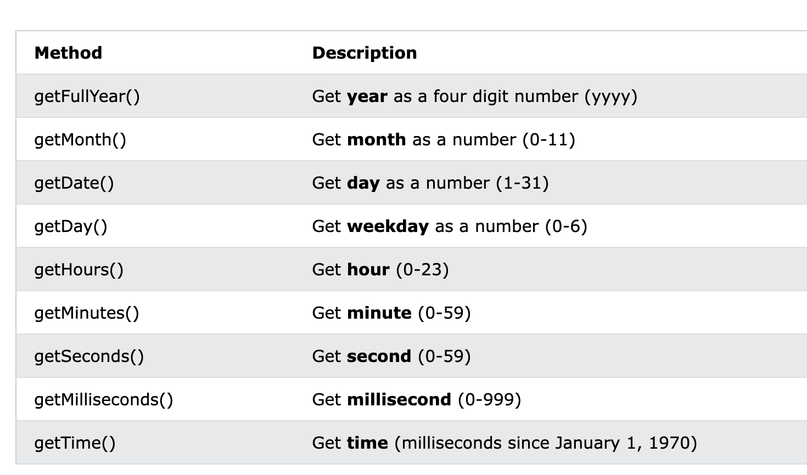
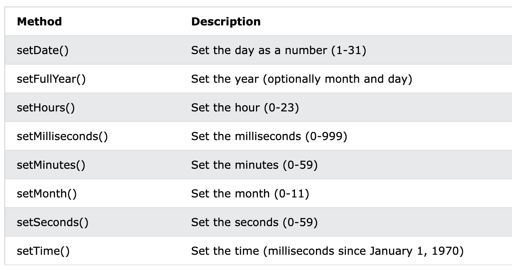

# Get Date Methods

[Demo: Date mehod](demo/js_date_1_method.html)

## Date 的 get 方法


**注意**
1.  get 方法返回的都是 `本地时间`
2.  对于 date 对象, 其时间不会随着真实时间 running

## getFullYear()

返回四位 year

```
const date = new Date(99,01,02) 
console.log(`year = ${date.getFullYear()}`) // 1999
```

## getMonth()

The getMonth() method returns the month of a date as a number `(0-11)`.

本地定义 月份 名称

```
const months = ["January", "February", "March", "April", "May", "June", "July", "August", "September", "October", "November", "December"];

const d = new Date("2021-03-25");
let month = months[d.getMonth()];
````

## getDate() 

The getDate() method returns the day of a date as a number (1-31):


## getDate()

The getDate() method returns the day of a date as a number (1-31):

**注意**: 是 getDate() 而不是 getDay()

## getHours()

The getHours() method returns the hours of a date as a number (0-23):

## getMinutes()

The getMinutes() method returns the minutes of a date as a number (0-59):

## getSeconds()

The getSeconds() method returns the seconds of a date as a number (0-59):

## getMilliseconds()

The getMilliseconds() method returns the milliseconds of a date as a number (0-999):

## getDay()

The getDay() method returns the weekday of a date as a number (0-6).

In JavaScript, the first day of the week (day 0) is Sunday.

## getTime()

The getTime() method returns the number of milliseconds since January 1, 1970:

## Date.now()

Date.now() returns the number of milliseconds since January 1, 1970.

---

# UTC Date Get Methods

上面介绍的方法都有对应的 UTC 方法, 返回 UTC-0 基准的年月日,时分秒.

没有 getUTCTime() 因为时间戳肯定是相同的

UTC methods use UTC time (Coordinated Universal Time).

UTC time is the same as GMT (Greenwich Mean Time).

The difference between Local time and UTC time can be up to 24 hours.

## The getTimezoneOffset() Method

The getTimezoneOffset() method returns the difference (in minutes) between local time an UTC time:

```
const date = new Date()
const minute = date.getTimezoneOffset() // 北京时间,返回 -480 相当于 8 个小数
```

---

# JavaScript Set Date Methods

[Demo: set ](demo/js_date_1_method.html)

Set Date methods let you set date values (years, months, days, hours, minutes, seconds, milliseconds) for a Date Object.



## setFullYear() 

```
const d = new Date();
d.setFullYear(2020);
```

The setFullYear() method can optionally set month and day:

```
const d = new Date();
d.setFullYear(2020, 11, 3);
```

## setMonth()

The setMonth() method sets the month of a date object (0-11):

## setDate() 

The setDate() method sets the day of a date object (1-31):

```
const d = new Date();
d.setDate(15);
```

The setDate() method can also be used to add days to a date:

```
const d = new Date();
d.setDate(d.getDate() + 50); // 自动转换为 50 天之后的日期
```

设置的 day 产生进位, Date 会自动处理

## setHours()

The setHours() method sets the hours of a date object (0-23):

```
const d = new Date();
d.setHours(22);
```

## setMinutes() ,setSeconds() 同理

## Compare Dates

```
const date = new Date(2023, 01, 01)
const date2 = new Date();
const date3 = new Date(1990, 01, 02);

 date2 > date // true
 date3 < date // true
```
