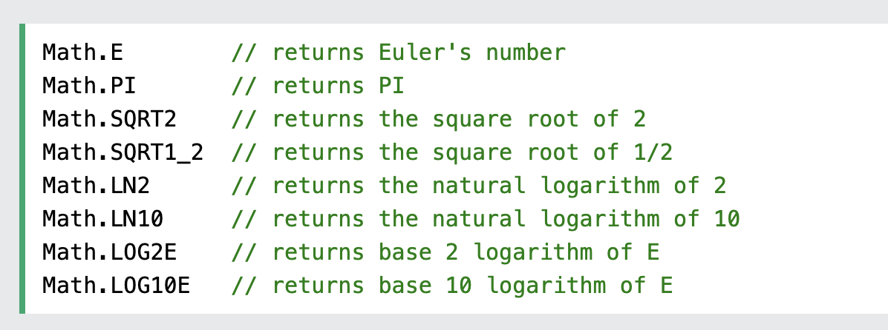

# JavaScript Math Object

[JS math](demo/js_math_0_basic.html)

The JavaScript Math object allows you to perform mathematical tasks on numbers.

## The Math Object

Unlike other objects, the Math object has no constructor.

The Math object is static.

All methods and properties can be used without creating a Math object first.

**总结**

1. Math 无需构造方法, 都是静态的

## Math Properties (Constants)

The syntax for any Math property is : Math.property.

JavaScript provides 8 mathematical constants that can be accessed as Math properties:



## Math Methods

The syntax for Math any methods is : Math.method(number)

## 关于 Number 的常见方法

- Math.round(x)	Returns x rounded to its nearest integer
- Math.ceil(x)	Returns x rounded up to its nearest integer
- Math.floor(x)	Returns x rounded down to its nearest integer
- Math.trunc(x)	Returns the integer part of x (new in ES6)

`Math.round()`

- 返回最近的 Integer (四舍五入?)
  
```
Math.round(4.4) is 4
Math.round(4.5) is 5
Math.round(4.6) is 5
```

`Math.ceil()`

Math.ceil(x) returns the value of x rounded up to its nearest integer:

返回大于入参的最近 Number (坐标轴右边的点)

```
Math.ceil(4.0) is 4
Math.ceil(4.8) is 5
Math.ceil(-4.0) is -4
Math.ceil(-4.9) is -4
```

`Math.floor()`

Math.floor(x) returns the value of x rounded down to its nearest integer:

返回小于入参的最近 Number (坐标轴左边的点)

```
Math.floor(4.0) is 4
Math.floor(4.8) is 4
Math.floor(-4.0) is -4
Math.floor(-4.9) is -5
```

`Math.trunc()`

Math.trunc(x) returns the integer part of x:

返回入参的整数部分

```
Math.trunc(4.0) is 4
Math.trunc(4.8) is 4
Math.trunc(-4.0) is -4
Math.flotruncor(-4.9) is -4
```

`Math.sign()`

Math.sign(x) returns if x is negative, null or positive:

返回
x > 0 : 1
x < 0 : -1
其他 0

```
Math.sign(4.0) is 1
Math.sign(-4.8) is -1
Math.sign(0) is 0
Math.sign(null) is 0
```

`Math.pow()`

Math.pow(x, y) returns the value of x to the power of y:

返回: x^y

```
Math.pow(2,4) is 16
Math.pow(3,3) is 27
```

`Math.sqrt()`

Math.sqrt(x) returns the square root of x:

开根号

```
Math.sqrt(16) is 4
```

`Math.abs()`

Math.abs(x) returns the absolute (positive) value of x:

绝对值

`Math.sin()`

三角函数: sin 值

**注意**: 入参是弧度, 如果使用的是角度,调用者需进行转换 弧度 = 角度 * PI / 180

```
Math.sin((90*Math.PI/180)) is 1
```

`Math.cos()`

三角函数: cos 值

`Math.min() and Math.max()`

Math.min() and Math.max() can be used to find the lowest or highest value in a list of arguments:

返回数组的最值

```
Math.min(0, 150, 30, 20, -8, -200) is -200
Math.max(0, 150, 30, 20, -8, -200) is 150
```

`Math.random()`

Math.random() returns a random number between 0 (inclusive), and 1 (exclusive):

返回 (0,1] 范围的随机值

`Math.log()`

Math.log(x) returns the natural logarithm of x.

The natural logarithm returns the time needed to reach a certain level of growth:

自然数 E 为底的对数

```
Math.log(1) is 0
Math.log(Math.E) is 1
Math.log(3) is 1.0986122886681096
Math.log(10) is 2.302585092994046
```

How many times must we multiply Math.E to get 10? : `Math.log(10);`

`Math.log2()`

Math.log2(x) returns the base 2 logarithm of x.

How many times must we multiply 2 to get 8? : `Math.log2(8) is 3`

2 为底的 对数

`Math.log10()`

Math.log10(x) returns the base 10 logarithm of x.

10 为底的 对数


