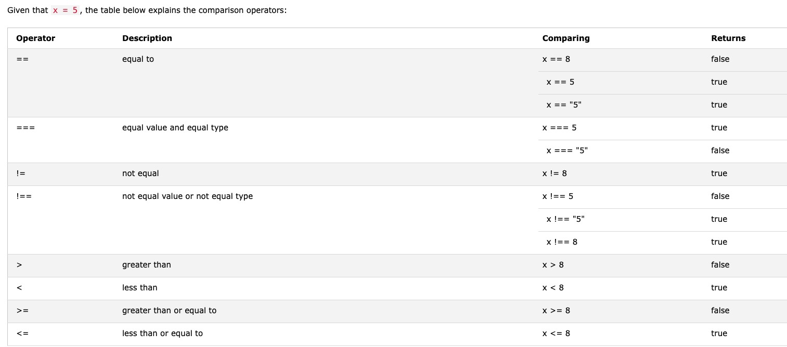

# JavaScript Booleans

[Demo](demo/js_boolean_0_basic.html)

A JavaScript Boolean represents one of two values:`true` or `false`.

## Everything With a "Value" is True

0 是 false

除了0,有具体值的对象都是 true. -3 is true

空值是 false

NaN is false

---

# JavaScript Comparison and Logical Operators

Comparison and Logical operators are used to test for true or false.

let x = 5, 其比较结果如下



可以利用条件判断来处理逻辑:

```
if (age < 18) text = "Too young to buy alcohol";
```

## Logical Operators

逻辑操作符: && || !

## Conditional (Ternary) Operator

三目运算: `variablename = (condition) ? value1:value2 `

## Comparing Different Types

不同数据类型比较

Comparing data of different types may give unexpected results.

When comparing a string with a number, JavaScript will convert the string to a number when doing the comparison. An empty string converts to 0. A non-numeric string converts to NaN which is always false.

```
2 < 12	    true	
2 < "12"	true	
2 < "John"	false	
2 > "John"	false	
2 == "John"	false	
"2" < "12"	false	
"2" > "12"	true	
"2" == "12" false
```

## The Nullish Coalescing Operator (??)

The ?? operator returns the first argument if it is not nullish (null or undefined).

Otherwise it returns the second argument.

如果对比值不是 nullish, 返回原值, 否则返回后面的值

```
let name = null;
let text = "missing";
let result = name ?? text;
```

## The Optional Chaining Operator (?.)

The ?. operator returns undefined if an object is undefined or null (instead of throwing an error).

---

