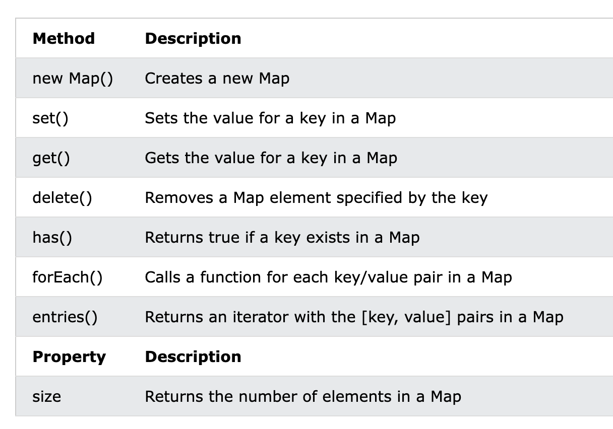
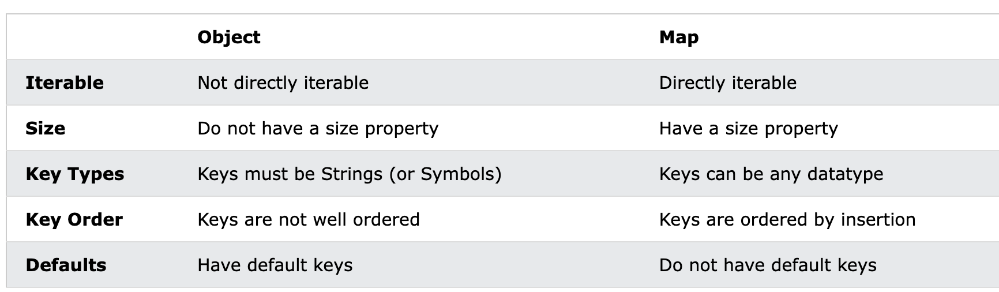

# JavaScript Sets

A JavaScript Set is a collection of unique values.

Each value can only occur once in a Set.

Set 常用方法和属性


## How to Create a Set

- Passing an Array to new Set()
- Create a new Set and use add() to add values
- Create a new Set and use add() to add variables

`new Set()`

```
const letters = new Set(["a","b","c"]);
```

`Create a Set and add values:`
```
// Create a Set
const letters = new Set();

// Add Values to the Set
letters.add("a");
letters.add("b");
letters.add("c");
```

`Create a Set and add variables:`

> 添加变量, 实际是变量的值,而不是变量本身

```
const set = new Set()
var a ="b"
set.add(a) // set 包含的是字符串 b
```

`add()`

```
letters.add("d");
letters.add("e");
```

If you add equal elements, only the first will be saved:

`forEach()`

[Demo forEach() 遍历](demo/js_set_map.html)

```
const letters = new Set(["a","b","c"]);

// List all Elements
let text = "";
letters.forEach (function(value) {
  text += value;
})
```

`values() `

[Demo values() 遍历](demo/js_set_map.html)

The values() method returns a new iterator object containing all the values in a Set:

you can use the Iterator object to access the elements:

```
// List all Elements
let text = "";
for (const x of letters.values()) {
  text += x;
}
```

---

# JavaScript Maps

[Demo: set](demo/js_set_map.html)

A Map holds key-value pairs where the keys can be any datatype.

A Map remembers the original insertion order of the keys.

Map 的常用方法



## 创建 Map

- Passing an Array to new Map()
- Create a Map and use Map.set()

`new Map with array`

```
const fruits = new Map([
  ["apples", 500],
  ["bananas", 300],
  ["oranges", 200]
]);
```

`use set() method`

```
// Create a Map
const fruits = new Map();

// Set Map Values
fruits.set("apples", 500);
fruits.set("bananas", 300);
fruits.set("oranges", 200);
```

`The get() Method`

```
fruits.set("apples", 200);
```

`The size Property`

```
fruits.size;
```

`The delete() Method`

```
fruits.delete("apples");
```

`The has() Method`

The has() method returns true if a key exists in a Map:

```
fruits.has("apples");
```

`Object 和 Map 的异同点`



**总结**: 
- map 可以直接遍历
- map 的 key 可以是任意类型
- map 的顺序是拆入的顺序(重复的舍去)


`The forEach() Method`

The forEach() method calls a function for each key/value pair in a Map:
> forEach 遍历, function 接收连个参数 value key

```
let text = "";
fruits.forEach (function(value, key) {
  text += key + ' = ' + value;
})
```

`The entries() Method`

The entries() method returns an iterator object with the [key, values] in a Map:
> 返回 [key value] 格式的迭代器 e[0] 获取 key e[1] 获取 value

```
map.set("1", "a")
map.set("3", "c")
map.set("10", "cc")
map.set("2", "b")

for (x of map.entries()) {
    console.log(`x is  ${x}, key is ${x[0]} value is ${x[1]}`)
}

// 输出:

x is  1,a, key is 1 value is a
x is  3,c, key is 3 value is c
x is  10,cc, key is 10 value is cc
x is  2,b, key is 2 value is b

```
