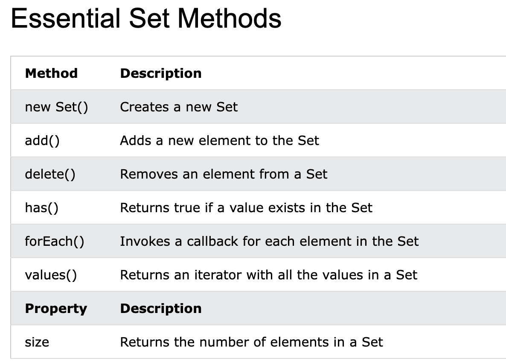

# JavaScript Sets

A JavaScript Set is a collection of unique values.

Each value can only occur once in a Set.

Set 常用方法和属性



## How to Create a Set

- Passing an Array to new Set()
- Create a new Set and use add() to add values
- Create a new Set and use add() to add variables

`new Set()`

```
const letters = new Set(["a","b","c"]);
```

`Create a Set and add values:`
```
// Create a Set
const letters = new Set();

// Add Values to the Set
letters.add("a");
letters.add("b");
letters.add("c");
```

`Create a Set and add variables:`

> 添加变量, 实际是变量的值,而不是变量本身

```
const set = new Set()
var a ="b"
set.add(a) // set 包含的是字符串 b
```

`add()`

```
letters.add("d");
letters.add("e");
```

If you add equal elements, only the first will be saved:

`forEach()`

[Demo forEach() 遍历](demo/js_set_map.html)

```
const letters = new Set(["a","b","c"]);

// List all Elements
let text = "";
letters.forEach (function(value) {
  text += value;
})
```

`values() `

[Demo values() 遍历](demo/js_set_map.html)

The values() method returns a new iterator object containing all the values in a Set:

you can use the Iterator object to access the elements:

```
// List all Elements
let text = "";
for (const x of letters.values()) {
  text += x;
}
```