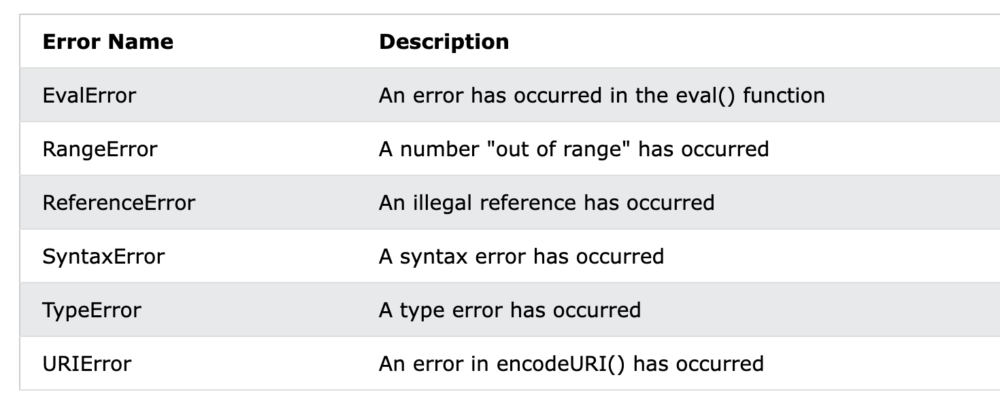

# JavaScript Errors

## Throw, and Try...Catch...Finally

The `try` statement defines a code block to run (to try).

The `catch` statement defines a code block to handle any error.

The `finally` statement defines a code block to run regardless of the result.

The `throw` statement defines a custom error.


## JavaScript try and catch

```
try {
  Block of code to try
}
catch(err) {
  Block of code to handle errors
}
```

## The throw Statement

The throw statement allows you to create a custom error.

Technically you can throw an exception (throw an error).

The exception can be a JavaScript String, a Number, a Boolean or an Object:

```
throw "Too big";    // throw a text
throw 500;          // throw a number
```

## The finally Statement

The finally statement lets you execute code, after try and catch, regardless of the result:

> 无论是否有异常, finally 都会执行

```
try {
  Block of code to try
}
catch(err) {
  Block of code to handle errors
}
finally {
  Block of code to be executed regardless of the try / catch result
}
```

## The Error Object

JavaScript has a built in error object that provides error information when an error occurs.

The error object provides two useful properties: name and message.

- name	    Sets or returns an error name
- message	Sets or returns an error message (a string)


Six different values can be returned by the error name property:
> name 属性返回如下 6 种类型



---

# JavaScript Scope

JavaScript has 3 types of scope:

- Block scope
- Function scope
- Global scope

Before ES6 (2015), JavaScript had only Global Scope and Function Scope.

ES6 introduced two important new JavaScript keywords: let and const.

`Block Scope`

**总结**:

1. let const 可以定义块作用域变量
2. var 在 {} 定义,是全局变量

[Demo: fun1()](demo/js_error_scope.html)

```
{
    let a = 'a'
    var b = 'b'
}
console.log(`a = ${a}`) // a is not defined
console.log(`b = ${b}`) // b = b
```


`Local Scope`

Variables declared within a JavaScript function, become LOCAL to the function.

They can only be accessed from within the function.

`Function Scope` 

JavaScript has function scope: Each function creates a new scope.

Variables defined inside a function are not accessible (visible) from outside the function.

Variables declared with var, let and const are quite similar when declared inside a function

**总结**:

1. 每个方法都会创建一个作用域
2. 定义在方法中的变量只在方法作用域中有效

[Demo: fun2()](demo/js_error_scope.html)
```
function test(){
    let a = 'a'
    var b = 'b'
    const c ='c'
}
console.log(`a = ${a}`) // a is not defined
console.log(`b = ${b}`) // b is not defined
console.log(`c = ${c}`) // c is not defined
```

`Global JavaScript Variables`

>全局作用域

Variables declared Globally (outside any function) have Global Scope.

Global variables can be accessed from anywhere in a JavaScript program.

Variables declared with var, let and const are quite similar when declared outside a block.

