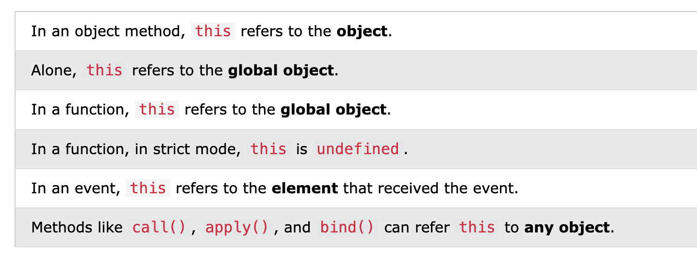

# The JavaScript this Keyword

In JavaScript, the this keyword refers to an object.

Which object depends on how this is being invoked (used or called).

The this keyword refers to different objects depending on how it is used:

不同的 this 代表不同的意义



**注意**

this 不是变量,是关键字,用户不可修改

## this in a Method

When used in an object method, this refers to the object.

## this Alone

When used alone, this refers to the global object.

Because this is running in the global scope.

In a browser window the global object is [object Window]:


## this in a Function (Default)

In a function, the global object is the default binding for this.

In a browser window the global object is [object Window]:

Example

```
function myFunction() {
  return this;
}
```

## this in a Function (Strict)

JavaScript strict mode does not allow default binding.

So, when used in a function, in strict mode, this is undefined.

Example

```
"use strict";
function myFunction() {
  return this;
}
```

## this in Event Handlers

In HTML event handlers, this refers to the HTML element that received the event:

```
<button onclick="this.style.display='none'">
  Click to Remove Me!
</button>
```

## Object Method Binding

In these examples, this is the person object:

```
const person = {
  firstName: "John",
  lastName : "Doe",
  id       : 5566,
  fullName : function() {
    return this.firstName + " " + this.lastName;
  }
};
```

---

JavaScript Arrow Function
