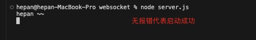
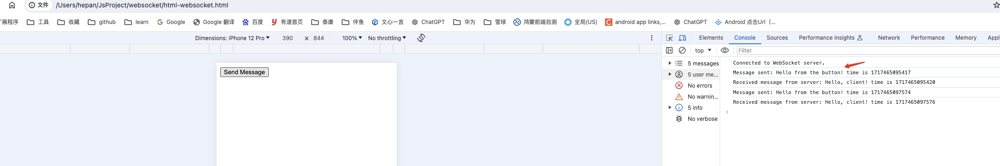
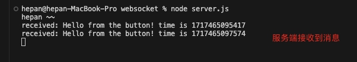

本项目利用 node 实现一个 websocket 服务端, 然后通过 html 链接并与服务端通信

# 创建并启动 websocket 服务

1. 首先确保安装了 node 等基础库
2. 安装 `ws` : `npm install ws`
3. 创建 server.js 文件, 利用 ws 实现一个 websocket 服务
4. 执行 node server.js 启动服务

  

# 链接 websocket 并通信

1. 创建文档 `html-websocket.html`
2. 实现 websocket 链接和发送信息相关代码
3. 利用浏览器打开上述文件

浏览器打开后点击按钮发送消息, 成功后会接收一个消息

服务端接受到消息并返回一个消息

