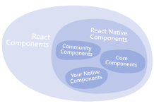

# Introduction


## Core Components and Native Components

介绍两个概念

- Native Components: 就是原生 View, 可以配合 JS 使用
- Core Components: RN 核心组件, 包括 View, ScrollView 等



---

## React Fundamentals

React Native 运行在 React 之上, React 是一个流行的 JS 页面开发框架. 为了最大利用 RN 功能, 了解 React 是有必要的

React 的核心概念

- components
- JSX
- props
- state

一个简单的 RN 例子: 

```
import React from 'react';
import {Text} from 'react-native';

const Cat = () => {
  return <Text>Hello, I am your cat!</Text>;
};

export default Cat;

```

首先利用 JS 的 `import` 导入需要的包

component 由 function 来定义, 可以把组件看成模板,无论方法返回什么, 都会在 UI 层展示.

最后利用 JS 的 `export default` 导出 component


## JSX

JSX 是一种语法, 可以用类似 `<Text>Hello, I am your cat!</Text>` 的样式写 JS 代码. 因为是 JS 代码, 所以可以直接定义变量使用

```
const Cat = () => {
  const name = 'Maru';
  return <Text>Hello, I am {name}!</Text>;
};
```

JS 代码放置在 {} 中执行,包括 function 调用

## Props

是 `properties` 的缩写, 通过传参实现 component 自定义能力, RN 的大部分核心组件都定义了参数传递, 例如 Image 传递 source

```
const Cat = (props: CatProps) => {
  return (
    <View>
      <Text>Hello, I am {props.name}!</Text>
    </View>
  );
};

const Cafe = () => {
  return (
    <View>
      <Cat name="Maru" />
      <Cat name="Jellylorum" />
      <Cat name="Spot" />
    </View>
  );
};
```

## State

While you can think of props as arguments you use to configure how components render, state is like a component’s personal data storage. State is useful for handling data that changes over time or that comes from user interaction. State gives your components memory!

可以认为 props 是设置组件如何渲染的参数, state 是组件自己的数据存储, state 用于处理随时间变动的数据, 或者处理与用户的交互, state 是组件具有记忆.


**总结**:

几个核心概念的关联: component 是组件 ，实现 UI，新的语法 jSX ，props 可以作为属性入参来实现 component 的自定义, 每次使用 setState 都会触发组件渲染。


---

# Handling Text Input