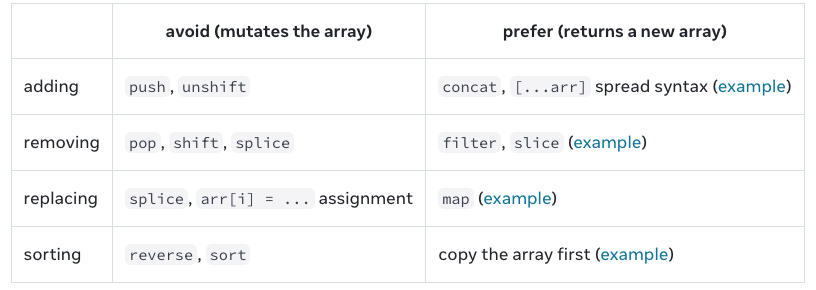

介绍 RN 中更新 array 相关知识点

原文链接 https://react.dev/learn/updating-arrays-in-state

RN 中, 认为 array 是不可变的, 在使用相关 API 时, 我们应避免下图左侧部分,优先使用右侧



---

# Adding to an array (添加元素)

在添加元素时, 我们应避免使用 `push()`, 因为这会导致原始 `array` 的变动

错误展示
```ts
const originArray = ["Apple", "Orange"]
const [myFruit, setMyFruit] = useState(originArray)
const [yourFruit, setYourFruit] = useState(originArray)

 const testFun = () => {
    myFruit.push("Banana") // 错误, 因为会导致 yourFruit 内容变动,两者
    // 为了刷新
    setCout(count + 1)
  }

```

正确展示
```ts
 const testFun = () => {
    let next = [...myFruit,"Banana"] // 利用 ... 拷贝一份, 然后再添加
    setMyFruit(next)
  }

```

---

# Removing from an array (移除元素)

结论: 移除元素使用 `filter` 方法
- Note that filter does not modify the original array.
- filter 会返回新数组,不会改变原始数组

```ts
 const testFun = () => {
    // 保留 index !== 0 的元素(移除第一个)
    let next = originArray.filter((v,i) => i !==0)
    setMyFruit(next)
}
```

---

# Transforming an array (转换, 改造数组)

结论: 使用 `map`

```ts
const testFun = () => {
    let next = myFruit.map((v, i) => {
      if (v === "Apple" || i === 10) {
        // 这里返回新的对象
        return v + "---"
      } else {
        return v
      }
    })
    setMyFruit(next)
  }

```

# Replacing items in an array  (替换数组对象,修改对象值)

结论: 使用 `map`

给数组中名字为 hepan 的对象年龄增加 1
```ts
  const originArray = [{ name: "hepan", age: 33 }, { "name": "xiaoli", age: 22 }]
  const [person, setPreson] = useState(originArray)

    const addAge = () => {
    let next = person.map((v, i) => {
      if (v.name === "hepan") {
        // 这里拷贝返回, 不能使用 v.age = v.age+1 这样的操作, 因为数组元素可能被其他地方引用
        return { ...v, age: v.age + 1 }
      } else {
        return v
      }
    })
    setPreson(next)
  }
```
---

# inserting into an array (插入元素)

结论:  `...` 操作符配合 `slice()`

```ts
 const originArray = [{ name: "hepan", age: 33 }, { "name": "xiaoli", age: 22 }]
const [person, setPreson] = useState(originArray)

const addItem = () => {
    let insertIndex = 1
    // 利用 ... 和 slice() 创建新的数组
    let next = [...person.slice(0, insertIndex),
    { name: "xiaozhang", age: 18 },
    ...person.slice(insertIndex)]

    setPreson(next)
  }

```

---

# Updating objects inside arrays (更新数组中对象)

总结: 即使 `copy` 也不能直接修改数组对象的值

```ts
 const testFun = () => {
    let arr = [{ age: 10 }]
    let copy = [...arr]
    copy[0].age = 11 // 会导致 arr 的改变
    console.log(`hepan arr = ${arr[0].age}`)
  }
```

原因: `...` 是浅拷贝, 拷贝后的对象仍然指向了原始对象. copy 只是创建了新的数组, 数组内元素指向不变.

---

# 全文总结

Recap
- You can put arrays into state, but you can’t change them.
- Instead of mutating an array, create a new version of it, and update the state to it.
- You can use the [...arr, newItem] array spread syntax to create arrays with new items.
- You can use filter() and map() to create new arrays with filtered or transformed items.
- You can use Immer to keep your code concise. (三方库 `import { useImmer } from 'use-immer';`)

