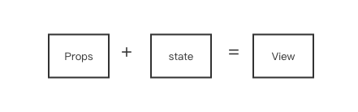
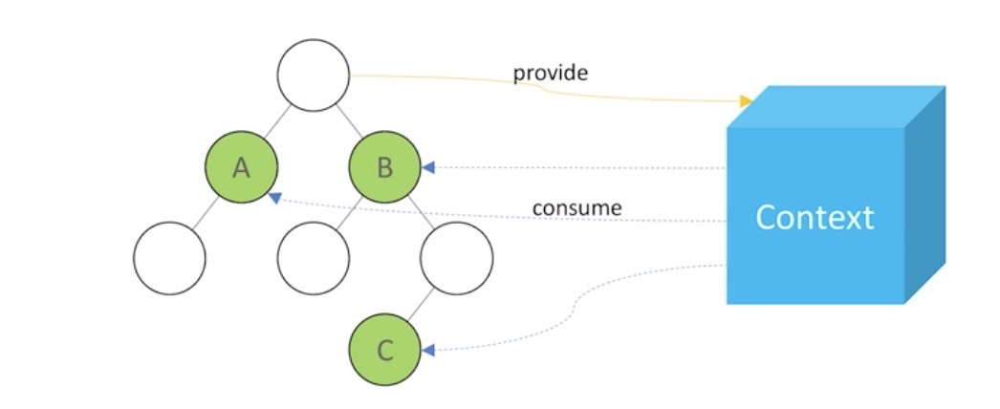

[课程源码](https://codesandbox.io/s/6n20nrzlxz?file=/src/)
# 课程源代码地址：
- Demo： https://6n20nrzlxz.codesandbox.io
- 源代码： https://codesandbox.io/s/6n20nrzlxz
- Gitee 仓库： https://gitee.com/geektime-geekbang/react-geek-time


# 第三讲以组件方式考虑 UI 构建



1. React 组件一般不提供方法，而是某种状态机
2. React 组件可以理解为一个纯函数：输入确定，输出确定
3. 单向数据绑定

## 创建组件的的原则： 单一责任原则
1. 能计算得到的状态就不要单独保存
2. 组件尽量使用 props ，少用 state

-----

# 第四讲JSX 本质，不是模板引擎，而是语法糖
1. 声明式创建页面：直观
2. 代码动态创建页面 ： 灵活
3. 无需学习新的模板语音

约定
1. React 默认小写 tag 是原始 DOM 节点
2. 自定义组件开头大写
3. JSX 标记可以直接使用属性语法，例如 <menu.item/>

----

# 第五讲 React 组件的生命周期和使用场景
1. Render 阶段
2. Pre-commit 阶段
3. commit 阶段

## 生命周期
1. constructor
   1. 用于初始化内部状态，很少使用
   2. 唯一可以修改 state 的地方

2. getDerivedStateFromProps
   1. 当 state 需要从 props 初始化时使用
   2. 尽量不要用，维护两者状态一致性会增加复杂度
   3. 每次 render 都会调用
   4. 典型场景：表单控件获取默认值

3. componetDidMount
   1. UI 渲染完成后调用
   2. 只执行一次
   3. 典型场景：获取外部资源

4. componetWillUnmount
   1. 卸载时调用
   2. 释放资源

5. 

----

# 第六讲 理解 Virtual DOM 及 key 熟悉的作用
> JSX 的运行基础： Virtual DOM

## 虚拟 DOM 的两个假设
1. 组件的 DOM 结构是相对稳定的
2. 类型相同的兄弟节点可以被唯一标识（利用 key 区分）

Virtual DOM diff 复杂度是 O(n), 节点跨层会直接删除重建。 而树的 diff 负责度是 O(n^3)

----

# 第七讲 组件设计模式：高阶组件和函数作为子组件

## 高阶组件 HOC
> 接受组件作为参数，返回新的组件（大部分是对传入组件增加新的属性）

```
// withTimer.js 
import React from "react";

export default function withTimer(WrappedComponent) {
  return class extends React.Component {
    state = { time: new Date() };
    componentDidMount() {
      this.timerID = setInterval(() => this.tick(), 1000);
    }

    componentWillUnmount() {
      clearInterval(this.timerID);
    }

    tick() {
      this.setState({
        time: new Date()
      });
    }
    render() {
      return <WrappedComponent time={this.state.time} {...this.props} />;
    }
  };
}
```

-----
# 第八讲 理解新的 Context API及其使用场景



根节点提供全局上下文， 子节点可以自动监听数据变化

```
const LocaleContext = React.createContext();
```
---

# 第九讲 使用脚手架工具创建 React
> 构建一个 React 项目的必备的工具， 官方提供 create-react-app 命令来集成这些工具包。是最简单策略

# 第十讲 打包部署
1. 编译 ES6 语言特性，编译 JSX
2. 整合资源，例如图片
3. 优化代码体积


## 打包注意事项
1. node.js 环境为 production
2. 禁用开发专用代码，如 logger
3. 设置应用根路径

