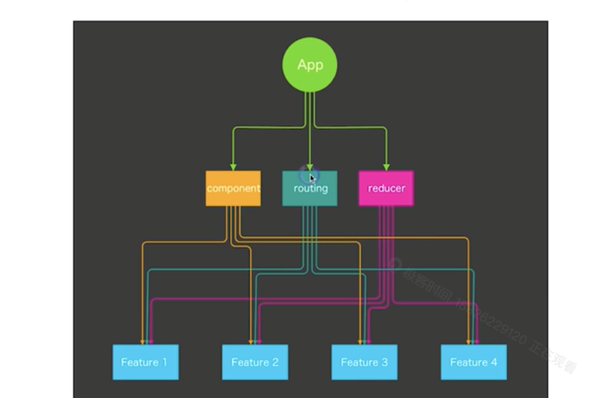
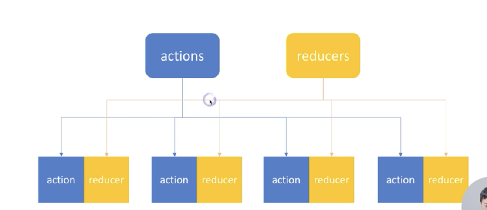

# 第三章 构建可维护扩展的前端应用

# 23 讲 理想架构: 可维护,可扩展,可测试,易开发,易构建
> 老师总结: 各个特性相互依存,相互排斥,尽量综合评估/选取

- 文档是否全面
- 功能分层是否清晰
- 副作用少
- 尽量使用纯函数
---

# 24 讲 拆分复杂度(1): 按领域模型(feature)组织代码,降低耦合度
> 按照功能拆分

---

# 25 讲 拆分复杂度(2) 组织 component action reducer
> 文件结构: 分类 & 聚合. 

---

# 26 讲 如何组织 React Router 的路由配置
> 建议使用 josn 定义一个顶层路由文件.

---

# 27 讲 使用 Rekit(1) 创建项目,代码生成和重构
# 28 讲 使用 遵循最佳实践,保持代码一致性
> 老师开源的一个 IDE + JS 开发工具集
- Rekit： https://github.com/supnate/rekit