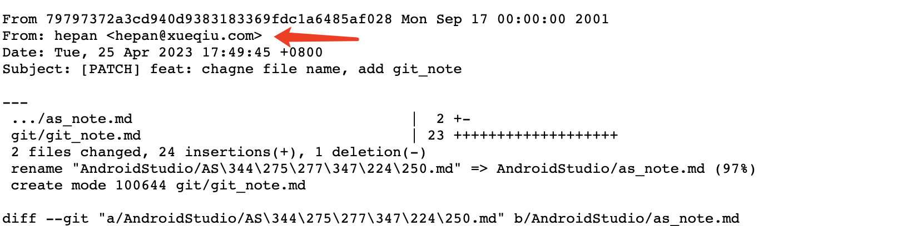
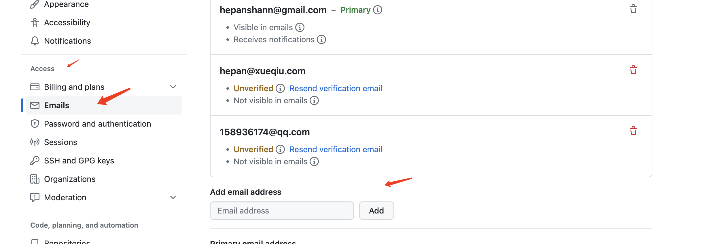

# 记录 git 使用问题 OR 知识点

# git alias
> 别名,有助于快速输入 git 命令: git config --global alias.st status
```
// 常用配置
alias.co=checkout
alias.br=branch
alias.ci=commit
alias.st=status
alias.sm=submodule
alias.cp=cherry-pick
```
---

# git worktree
> 实现同一项目打开多个 git 窗口, 提高开发效率

步骤
-  创建 workfile, 指定一个不存在的分支

    `git worktree add ../new-dir not-existing_branch`

- IDE 打开新项目 new-dir
- 切换为正常分支(和已开项目分支不同)
  
---


# git 相关

## github 没有正确统计提交记录

  原因: github 默认只统计对应 email 的 commit

  可以通过在 commit 链接后面添加 .patch 查看提交时携带的 email 信息

  [add .patch](https://github.com/HeCaser/work-file/commit/79797372a3cd940d9383183369fdc1a6485af028.patch)

  

  解决: 在 github setting 中添加 email (不限个数)

  