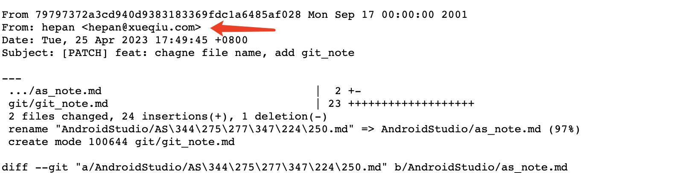
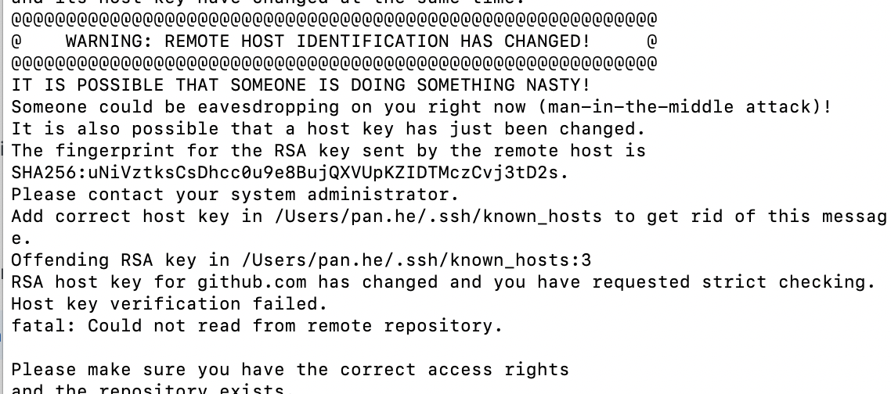

# github 没有正确统计提交记录

  原因: github 默认只统计对应 email 的 commit

  可以通过在 commit 链接后面添加 .patch 查看提交时携带的 email 信息

  [add .patch](https://github.com/HeCaser/work-file/commit/79797372a3cd940d9383183369fdc1a6485af028.patch)

  

  解决: 在 github setting 中添加 email (不限个数)

  

  ---

  # github 连接报错

 

  [解决办法](https://stackoverflow.com/questions/20840012/ssh-remote-host-identification-has-changed/44293270#44293270)

  办法1： 删除 `/Users/pan.he/.ssh/known_hosts` ，后重新连接即可

