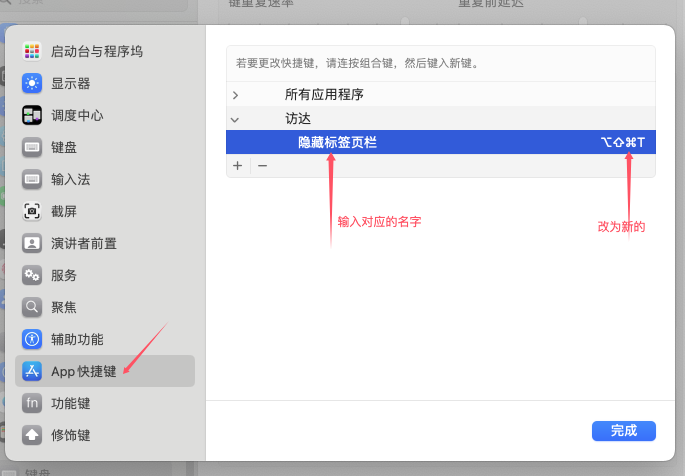

## 如何设置快捷键, 在当前文件夹下打开终端

进入系统偏好设置 > 键盘 > 快捷键 > 服务。

在服务列表中，找到“文件和文件夹”部分下的“在文件夹中打开新终端”。

勾选旁边的框以启用此服务。
（可选）点击“添加快捷键”以分配一个键盘快捷键（例如，Command + Shift + T）。

## 快捷键与现有程序 访达 冲突, 如何给 访达 设置新的快捷键

访达有个快捷键, 名称叫做 **隐藏标签页栏** 修改前的快捷键 是 Command + Shift + T , 与上面设置的冲突.

对访达快捷键进行修改: 进入系统偏好设置 > 键盘 > 快捷键 > App 快捷键

## 快捷键打开的终端, 无法运行某些命令, 但是从根目录 cd 到当前文件夹后可以使用该命令

原因: 全局 PATH 导出时可能使用了 pwd 命令来定位目录, 例如 `export PATH="$pwd/flutter/bin:$PATH"`

解决: 改为固定目录 `export PATH="/Users/panhe/flutter/flutter/bin:$PATH"`