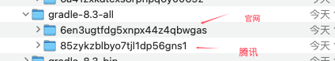

在 Android 应用的构建中，会用到 gradle
1. 推荐使用 wrapper 管理 gradle 
2. 不推荐使用本地文件管理

问题： 官网下载 `distributionUrl=https\://services.gradle.org/distributions/gradle-8.3-all.zip` 有时会很慢

 腾讯镜像  `distributionUrl=https\://mirrors.cloud.tencent.com/gradle/gradle-8.3-all.zip`
 
 腾讯镜像官网地址：

 https://mirrors.cloud.tencent.com

 https://mirrors.cloud.tencent.com/gradle/

注意： 两个地址下载的版本虽然相同，但是在系统 文件 .gradle 中是不同的（签名校验不同？），截图如下

Q: 咨询 chatgpt 是否重复下载
when i download gradle from a mirror host, like distributionUrl=https\://mirrors.cloud.tencent.com/gradle//gradle-8.6-all.zip , after the download complete , i change the url to official host like https\://services.gradle.org/distributions/gradle-8.6-all.zip, do i need download the same version again?

A： 貌似不用
No, you don’t need to download the same version again, as long as the file you downloaded from the mirror host is valid and placed in the correct directory. Here's how Gradle handles this situation:

How Gradle Downloads and Caches Files
Gradle stores downloaded distributions in the .gradle directory, typically located in your home directory (~/.gradle on Linux/Mac or %USERPROFILE%\.gradle on Windows).
When the distributionUrl in your gradle-wrapper.properties points to a Gradle version, Gradle checks if it already has the corresponding distribution in the cache. If it exists, it skips the download.
What Happens When You Change the URL
If the Gradle version (gradle-8.6-all.zip in your case) is already downloaded and cached, Gradle won’t download it again, regardless of whether the URL has changed, as long as:
The file matches the expected checksum (to ensure integrity).
The cache location is the same.
Steps to Avoid Redownloading
Verify the Downloaded File:

Ensure the file downloaded from the mirror host is complete and not corrupted.
Optionally, you can verify the checksum of the file against the one provided on the official Gradle releases page.
Move the File to the Cache (if not already there):

Place the file in the .gradle/wrapper/dists directory under the appropriate subfolder. For example:
python
Copy code
~/.gradle/wrapper/dists/gradle-8.6-all/<unique-folder-name>/gradle-8.6-all.zip
Gradle generates the <unique-folder-name> based on the distributionUrl. If you're unsure, run the Gradle command once to let it create the folder, then move the file there.
Run Gradle:

After updating distributionUrl to the official host, run any Gradle command (e.g., ./gradlew build). If the file is already cached, Gradle will use it.
