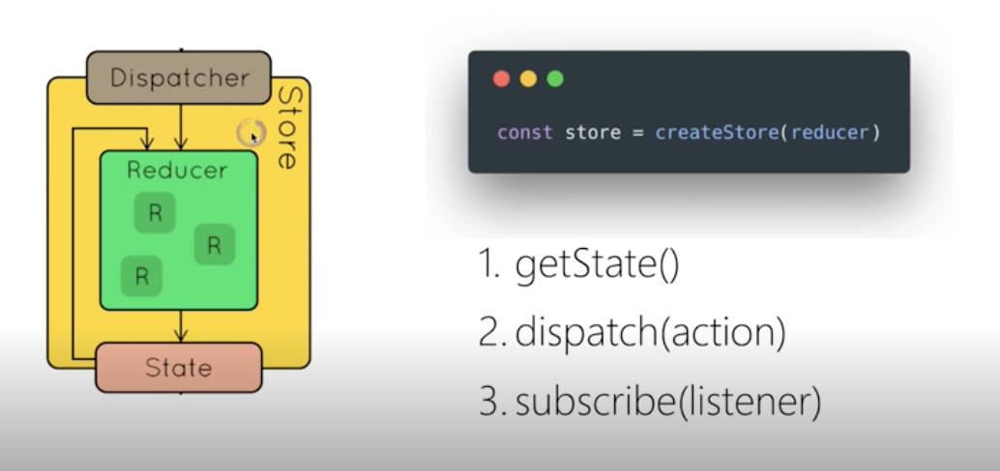
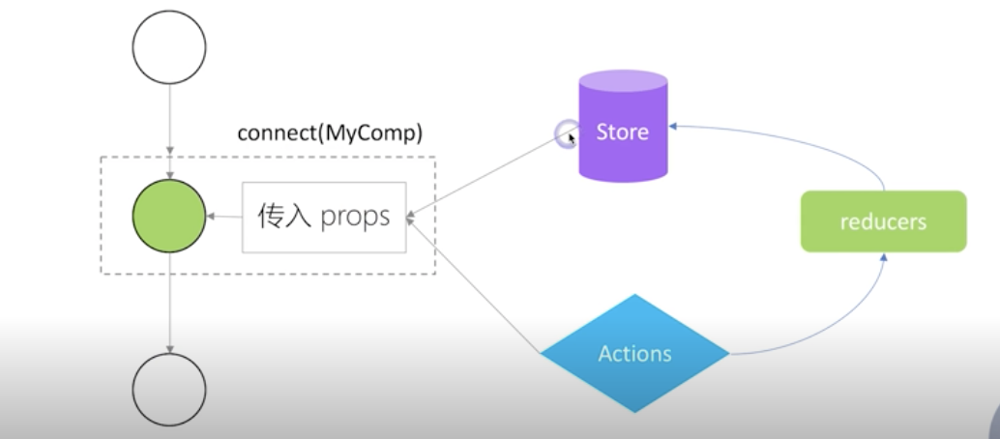
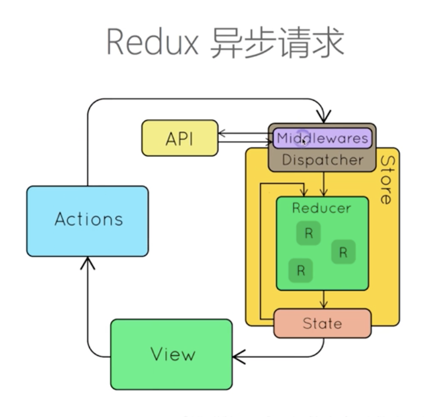

# 第二章 React 生态圈

# 11 讲 Redux（1）前端为何需要状态管理库

- 页面所有状态在一个 Store 中，状态变化后，页面刷新。
- Store 是 Tree 结构,与 DOM 基本对应

## React 组件通讯缺点 
- 需要父组件一层层的传递给子组件属性
- 子组件影响父组件需要暴露事件给父组件
- 同级组件更新需要父组件桥接

## Redux 优点
- Store 进行全局存储,在 Dom 外控制状态
- 可以让组件间通讯更加方便

## Redux 特性
- Single Source of Truth
- state + action = new state: 状态改变是产生新的 state,不是更新 state
- 纯函数更新 Store: 输出完全依赖输入,不受外部任何状态影响
---

# 12 讲 Redux（2）深入理解 Store、Action、Reducer

- Store Dispatcher Action to Reducer
- Reducer: 函数, 接收 state , Action 产生新的 state
- Action: 描述行为

>老师总结: Redux 严格说与 React 没有关系, 与 UI 也没有关系, 可以单独作为状态管理器使用,只是状态的改变经常体现在 UI 上.

---

# 13 讲 Redux（3） : 在 React 中使用 Redux
Usage with React： https://redux.js.org/basics/usage-with-react

利用 connect 完成

---

# 14 讲 Redux（4） : 理解异步 Action、Redux 中间件

Middleware
- 截获 action
- 发出 action 

> 老师总结: 本质并不是发出异步 Action, 而是中间件识别特殊 Action (例如发现其是一个返回 Promise 的函数), 中间件等待 Promise 结束后, 发送新的 Action. 利用多个同步 Action 来实现异步逻辑.

---

# 15 讲 Redux（5） : 如何组织 Action 和 Reducer
> 本节讲解代码组织结构,不涉及知识点

建议: 单个 action 和 reducer 放在同一个文件

---

# 16 讲 Redux（6） : 理解不可变数据（Immutability）
> 数据修改: 复制一份新数据, 更新某个数据

## 为和需要不可变数据
- 性能优化: 无需对比各个节点变动, 引用变动则意味着状态变化
- 易于调试和跟踪
- 易于推测

## 如何操作不可变数据
- 原生写法: {...} ,Object.assign
- 三方工具: immutability-helper
- 三方工具: immer
---

# 17 讲 React Router（1）：路由不只是页面切换，更是代码组织方式

## 为什么需要路由
- 单页应用需要页面切换
- 通过 URL 可以定位到页面
- 更有语义的组织自选

## React Router 的特性
- 声明式路由定义
- 动态路由

## 实现方式
- URL 路径:  www.****/home/page1. 
- hash 路由: 低版本浏览器不支持 url 改变后不刷新, 利用 www.****/home/#/page1
- 内存路由

---

# 18 讲 React Router（2）：参数定义，嵌套路由的使用场景

## 如何传递,获取参数
- URL 后面拼接: /topic:id . id 是传递的参数
- 获取参数: match.params.id
  
## 何时需要 URL 参数
- 页面状态尽量通过 URL 参数定义

---

# 19 讲  UI 组件库对比和介绍：Ant.Design、Material UI、Semantic UI

- Ant.Design： https://ant.design/index-cn
- Material UI： https://material-ui.com/
- Semantic UI： https://react.semantic-ui.com/

> 老师总结: Ant 各方面比较全面, 优先推荐
---

# 20 讲 使用 Next.js 创建 React 同构应用
> 服务端渲染,服务端的状态能够传到前端

Next.js： https://nextjs.org/

## 页面创建
- 页面就是 pages 目录下的一个组件
- static 目录映射静态文件
- page 具有特殊静态方法 getInitialProps

## 在页面中使用其他 React 组件
- 页面也是标准 node 模块, 可以使用其他 React 组件
- 页面会针对性打包, 仅包含其引入的组件

---

# 21 讲 使用Jest、Enzyme等工具进行单元测试
> 介绍 React 单元测试相关工具
  
- Jest： https://jestjs.io/
- Enzyme： http://airbnb.io/enzyme/

---
# 22 讲 常用开发调试工具：ESLint、Prettier、React DevTool、Redux DevTool
- ESLint： https://eslint.org/
- Prettier： https://prettier.io/
- React DevTool： https://github.com/facebook/react-devtools
- Redux DevTool： https://github.com/reduxjs/redux-devtools