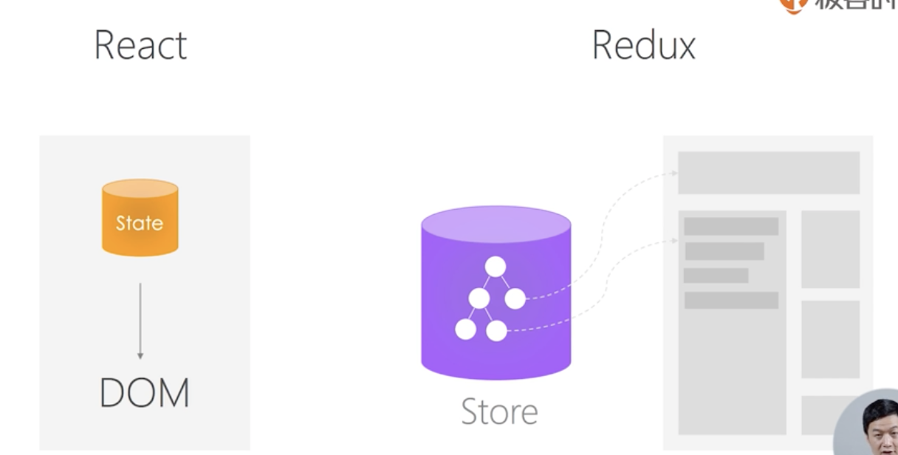
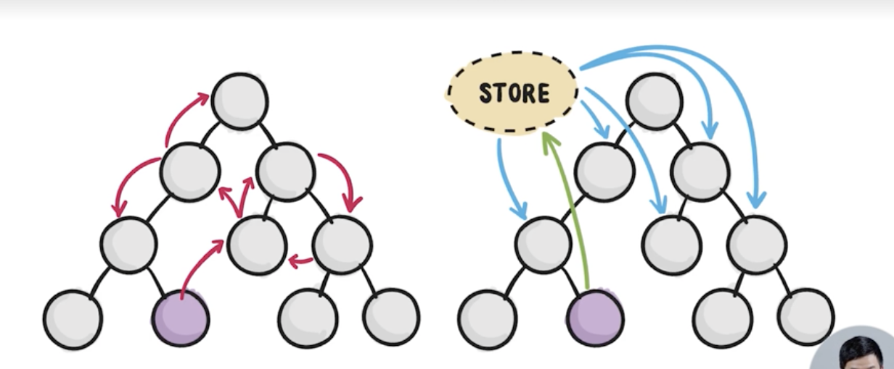

# 第二章 React 生态圈

# 11 讲 Redux（1）前端为何需要状态管理库

- 页面所有状态在一个 Store 中，状态变化后，页面刷新。
- Store 是 Tree 结构,与 DOM 基本对应

## React 组件通讯缺点 
- 需要父组件一层层的传递给子组件属性
- 子组件影响父组件需要暴露事件给父组件
- 同级组件更新需要父组件桥接

## Redux 有点
- Store 进行全局存储,在 Dom 外控制状态
- 可以让组件间通讯更加方便

----

# 12 讲 Redux（1）深入理解 Store、Action、Reducer