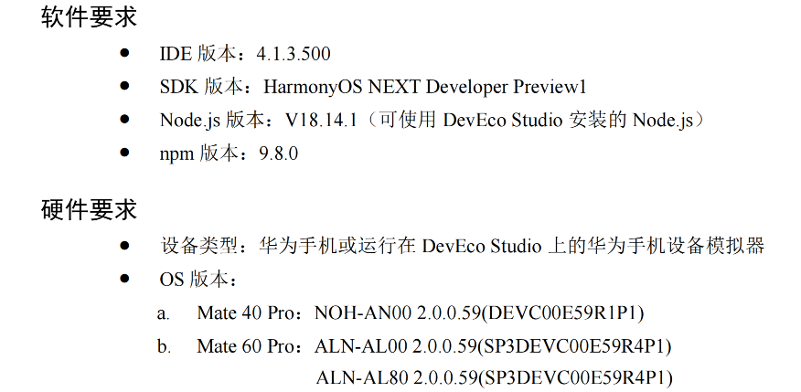
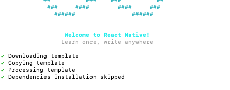

# 记录华为 NEXT 系统接入 RN 项目的步骤


## 2023-03-12 环境配置
> 目前仅支持特定 RN 版本的支持, 对基础工具版本也有一定要求(见下图)
> 
[华为-RN接入鸿蒙文档](<鸿蒙接入RN/华为资料/docs/ReactNative for OpenHarmony开发使用指导-4.1.0.300.pdf>)



更新 node 和 npm
- 利用工具 https://github.com/nvm-sh/nvm 管理 node (npm) 版本
- 使用命令 `nvm use 18` 切换 node 版本,  `控制台输出: Now using node v18.14.1 (npm v9.3.1)`
- 注意: nvm 控制 node 版本时,会同时切换 npm 版本, 与上面要求的 npm 版本(9.8.0) 不一致, 先忽略

配置 hdc 
- hdc 是华为 SDK 提供的工具, 本地地址可以通过 DEV-Studio 查看
- 配置 hdc 路径为全局变量, 并且配置 `HDC_SERVER_PORT`

```zsh
export PATH=${PATH}:/Users/hepan/Library/Huawei/Sdk/HarmonyOS-NEXT-DP1/base/toolchains
HDC_SERVER_PORT=7035
launchctl setenv HDC_SERVER_PORT $HDC_SERVER_PORT
export HDC_SERVER_PORT
```
- `hdc -v` 查看是否配置成功(输出 Ver: 2.0.0a 代表完成)


## 2023-03-12 环境配置 创建 RN 工程
[RN 项目地址](https://github.com/HeCaser/RNForHarmony)

- 利用如下命令创建 RN 项目, 这里需要指定版本

`npx react-native@0.72.5 init RNForHarmony --version 0.72.5 --skip-install`

- 项目创建成功(下图)



- 运行项目
  - AS 打开 RN 项目, 先执行 `yarn install` 或者 `npm i` 按照项目依赖的库
  - 执行 `yarn start` 运行 RN 项目. 如果 Metro 运行成功则代表项目完成初始化

